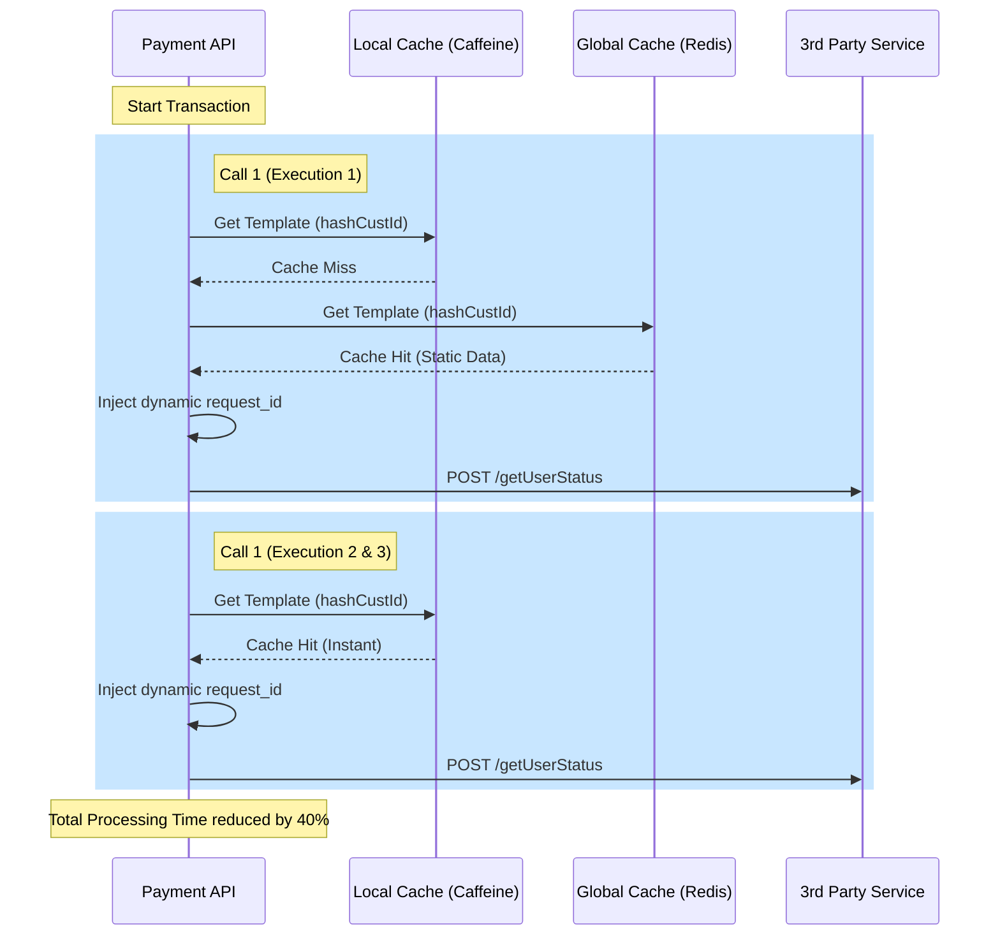

As a Senior Architect in high-performance payment systems, I will analyze your strategy. In a payment environment, **Latency** and **Idempotency** are your two biggest concerns.

### 1. The Architectural Critique

**Why Option 1 (request_id) is Weak:**
Caching against `request_id` is redundant. If you are already within a single transaction flow, that data is already in your application's **local memory (stack/heap)**. Adding a network hop to a cache (like Redis) to fetch a payload for the same transaction actually **increases** latency rather than decreasing it.

**Why Option 2 (hashCustomerId) is Superior:**
This is the correct "Senior Level" approach. By caching a **Template** against the `hashCustomerId`, you achieve "Cross-Transaction Optimization." 
*   **Performance Gain:** You avoid the computation cost of fetching user preferences, channel configurations, and platform settings from the DB for every single call.
*   **Persistence:** Even if the transaction expires, the next time the user performs an action (within 24 hours), the payload is ready.

---

### 2. The Recommended Design Pattern: "The Template Injection Pattern"

Instead of caching a "Static String," you should cache a **"Partial POJO (Template)"** against the `hashCustomerId`. 

#### The Strategy:
1.  **Key:** `req_tmpl:{hashCustomerId}:{callType}` (e.g., `req_tmpl:abc123:getUserStatus`)
2.  **Value:** A JSON object containing all the **Static Fields** (Channel_id, Platform, Login_id, etc.).
3.  **Runtime:** Fetch the template, "Inject" the dynamic fields (`request_id`, `timestamp`, `channel`), and send.

---

### 3. High-Performance Implementation (Java)

I recommend using a **Two-Tier Cache** strategy: 
*   **L1 (Caffeine):** In-memory (Local to the JVM) for ultra-fast access.
*   **L2 (Redis):** Distributed (Cross-Server) with a 24hr TTL.

```java
public class RequestPayloadGenerator {

    // Helper to generate the unique ID at runtime
    private String generateRequestId() {
        return UUID.randomUUID().toString().replace("-", "");
    }

    /**
     * Logic for Call 1: getUserStatus
     * High Performance: Fetches static template and injects dynamic request_id
     */
    public UserStatusRequest buildCall1(String hashCustomerId, String currentChannel) {
        // 1. Get Base Template from Cache (Key: hashCustomerId)
        UserStatusRequest template = cacheService.getTemplate(hashCustomerId, "CALL1");

        // 2. If null, build from DB and save to cache
        if (template == null) {
            template = repository.fetchStaticData(hashCustomerId);
            cacheService.putTemplate(hashCustomerId, "CALL1", template);
        }

        // 3. Inject Dynamic Fields (Low CPU overhead)
        template.setRequestId(generateRequestId());
        template.setChannel(currentChannel); 

        return template;
    }
}
```

---

### 4. Detailed Nested Flow Analysis

For your team to understand the optimization, here is the flow of a single transaction involving 3 calls to Call1 and 2 calls to Call2.



---

### 5. Final Comparison & Finalization

| Feature | Option 1 (request_id) | Option 2 (hashCustomerId) | **Architect's Choice** |
| :--- | :--- | :--- | :--- |
| **TTL** | 15 Mins | 24 Hours | **24 Hours** |
| **Reuse** | None (Single Txn) | High (Multiple Txns) | **High** |
| **Latency** | Medium (Redis overhead) | Ultra-Low (L1 + L2) | **Ultra-Low** |
| **Maintenance** | High (Too many keys) | Low (1 key per user) | **Low** |
| **Complexity** | Simple | Requires "Injection" logic | **Option 2** |

### Senior Architect's Verdict:
**Use Option 2 (hashCustomerId).** 

**Why?** In a payment system, users often retry failed payments or perform multiple actions in one session. Caching against `hashCustomerId` ensures that even if the first transaction fails, the second one starts **instantly** with pre-warmed data. 

**One Warning:** Since you are caching against `hashCustomerId` for 24 hours, ensure you have a **Cache Eviction Trigger** if the user changes their profile (e.g., updates their Login_ID or Platform permissions), otherwise, you will send stale data to the 3rd party service.
